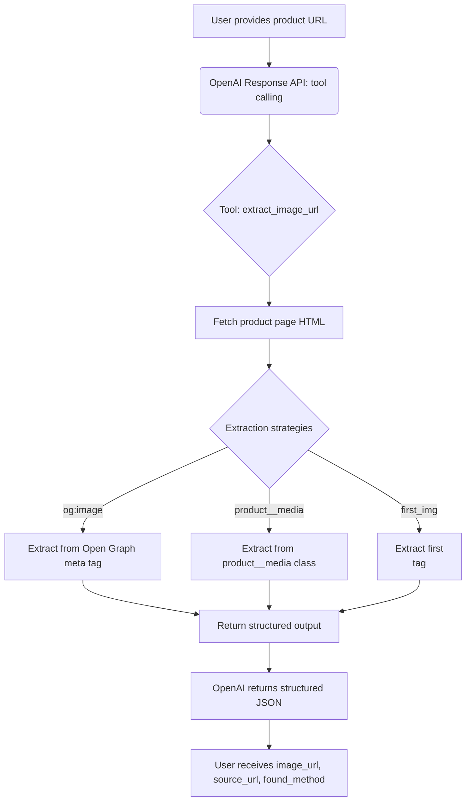

# OpenAI Get Item Image


This repository demonstrates how to use OpenAI's Response API (with GPT-4.1 and tool calling) to extract the main product image URL from an e-commerce product page. It provides both Python and TypeScript implementations, returning a structured output for easy integration.

## Features

- Extracts the main product image URL from a given e-commerce product page.
- Uses OpenAI tool-calling to orchestrate the extraction process.
- Returns a structured response with the image URL, source URL, and extraction method.
- Supports both Python and TypeScript (Node.js) environments.

## How it Works

- The script fetches the product page HTML.
- It tries to extract the main image using Open Graph (`og:image`), a product image class, or the first image on the page.
- The result is returned in a structured format, including the extraction method used.

## Flow Diagram



## Example Output

```json
{
  "image_url": "http://minecraftshop.com/cdn/shop/files/MINE-PLU1_R_MF_1200x1200.jpg?v=1729532536",
  "source_url": "https://minecraftshop.com/collections/plush/products/minecraft-goat-8-plush",
  "found_method": "og:image"
}
```

## Requirements

- Python 3.8+ (for Python version)
- Node.js 18+ (for TypeScript version)
- Access to Azure OpenAI or OpenAI API (with appropriate keys and endpoint)

## Setup

### 1. Clone the repository

```sh
git clone <repo-url>
cd get-item-image
```

### 2. Environment Variables

Copy `.env.sample` to `.env` and fill in your API keys and endpoints:

```sh
cp .env.sample .env
```

Edit `.env` and set:

- `AZURE_OPENAI_V1_API_ENDPOINT`
- `AZURE_OPENAI_API_KEY`
- `AZURE_OPENAI_API_MODEL`

### 3. Install Dependencies

#### Python/.py

```sh
pip install -r requirements.txt
# or manually:
pip install openai python-dotenv beautifulsoup4 requests
```

#### TypeScript/Node.js

```sh
npm install
```

## Usage

### Python

```sh
python get_item_image.py "https://minecraftshop.com/collections/plush/products/minecraft-goat-8-plush"
```

### TypeScript

```sh
npx ts-node get_item_image.ts "https://minecraftshop.com/collections/plush/products/minecraft-goat-8-plush"
```

## File Overview

- `get_item_image.py` — Python implementation
- `get_item_image.ts` — TypeScript/Node.js implementation
- `.env.sample` — Example environment variable file
- `demo.gif` — Demo animation

## License

MIT
